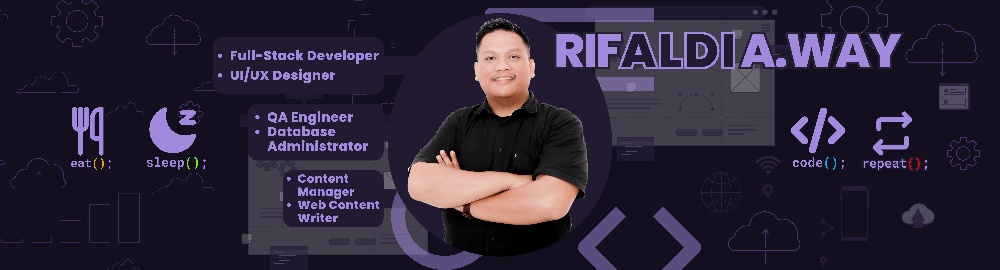

<!-- ====================== BANNER ====================== -->

  

<!-- HEADER -->

  
# 👋 Hi, I'm **Moh. Rifaldi A. Way**

### _Web Developer • IT Educator • Technology Explorer_

 

 

---

## 🧑‍💻 About Me

Halo! Saya **Moh. Rifaldi A. Way**, seorang Web Developer dan Pendidik yang berdedikasi membangun aplikasi modern sekaligus membimbing talenta-talenta muda di bidang Rekayasa Perangkat Lunak (RPL).

Saya percaya bahwa teknologi adalah alat untuk mempermudah pekerjaan manusia, dan saya mewujudkannya melalui kode yang bersih, terstruktur, dan efisien.

- 🔭 Bekerja sebagai Tenaga Pendidik IT di **SMK Informatika Komputer Ampana Kota**
- 🚀 Berpengalaman dalam arsitektur **PHP MVC Custom**, **Object-Oriented Programming (OOP)**, dan **Database Management**
- 📚 Saat ini berfokus mendalami **Laravel**, **REST API**, dan **Clean Architecture**
- 🎯 Tujuan: Menjadi Fullstack Developer yang tangguh di backend dan terus menciptakan solusi digital yang bermanfaat
- 💡 Tertarik pada UI minimalis, desain basis data, automasi, serta digital content creation

---

## 🛠 Tech Stack

### 🚩 Languages

  

### 🚀 Frameworks & Architecture

  

*(Experienced in building Custom PHP MVC Architectures)*

### 🗄️ Databases

  

### ⚙️ Tools & Platforms

  

---

## 📂 Highlighted Projects  

### 📌 **Aplikasi Peminjaman Alat (App_PeminjamanAlat)**
Sistem inventaris dan peminjaman alat berbasis web yang dibangun dari awal menggunakan arsitektur **Custom PHP MVC**. Dilengkapi dengan fitur manajemen barang, sistem *trigger* database yang dinamis, serta antarmuka yang dioptimalkan untuk keperluan ujian praktik siswa.

### 📌 **Sistem Ujian Akhir Sekolah Online Anti-Curang**
Platform ujian sekolah (Ujian Akhir Semester) berbasis web untuk mata pelajaran Web Programming. Dibangun dengan memanfaatkan **Google Apps Script** dan **Google Sheets**, sistem ini mengintegrasikan mekanisme anti-kecurangan dan batasan waktu (*timer constraints*) yang ketat.

---

## 📘 What I'm Learning Now

Saat ini saya sedang mendalami dan meningkatkan keterampilan pada:

- 🔹 Laravel Best Practices & Clean Code  
- 🔹 Blade Components & Layouting  
- 🔹 Eloquent Relationship (One-to-Many, Many-to-Many)  
- 🔹 Authentication & Authorization  
- 🔹 REST API Development  
- 🔹 Dasar deployment (shared hosting / VPS)

> Belajar sedikit demi sedikit, yang penting **konsisten** ✔️

---

## 📊 GitHub Analytics

  <!-- Streak Stats -->
  

    

  <!-- Main Stats -->
  

  <!-- Top Languages -->
  

---

## 🔥 GitHub Activity 🐍

  <picture>
    <source media="(prefers-color-scheme: dark)" srcset="https://raw.githubusercontent.com/muhrifaldiway/muhrifaldiway/output/github-contribution-grid-snake-dark.svg" />
    <source media="(prefers-color-scheme: light)" srcset="https://raw.githubusercontent.com/muhrifaldiway/muhrifaldiway/output/github-contribution-grid-snake.svg" />
    
  </picture>

---

## ✨ Fun Facts About Me

- ☕ Ngoding paling fokus saat ditemani kopi  
- 🎬 Di luar koding, saya juga menikmati proses digital content creation dan video editing  
- 🔍 Senang mencari solusi untuk error yang “ngeyel”, baik di *software* maupun perakitan *hardware*  
- 🎧 Musik + koding = kombinasi produktif  
- 📌 Motto: _“Small progress every day beats perfection someday.”_

---

## 📫 Let's Connect

- 🐱 **GitHub:** [github.com/muhrifaldiway](https://github.com/muhrifaldiway)
- 📧 **Email:** moh.rifaldi2776@guru.smk.belajar.id
- 📸 **Instagram:** [@kongkowlipu_](https://instagram.com/kongkowlipu_)

---

  
### 🌟 _Thanks for visiting my profile!_  
_"Keep learning, keep building."_ 🚀  

